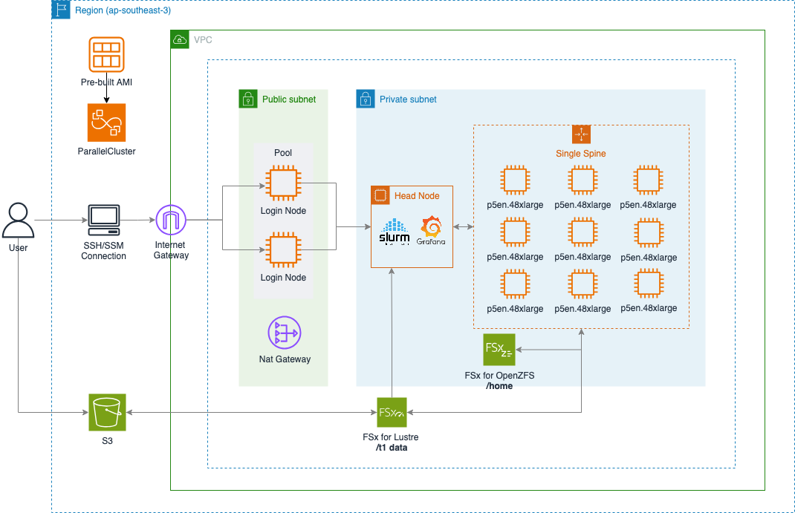

# AWS ParallelCluster for p5en.48xlarge with Monitoring & NCCL Tests



A comprehensive solution for deploying AWS ParallelCluster optimized for p5en.48xlarge instances with H200 GPUs, including monitoring stack and NCCL performance testing.

## 🏗️ Architecture Overview

### Cluster Architecture

```
┌─────────────────┐    ┌─────────────────┐    ┌─────────────────────────┐
│   LoginNode     │    │   HeadNode      │    │   ComputeNodes          │
│   (m5.large)    │    │   (m5.8xlarge)  │    │   (p5en.48xlarge)       │
├─────────────────┤    ├─────────────────┤    ├─────────────────────────┤
│ • User Access   │    │ • Slurm Master  │    │ • 8x H200 GPUs (141GB)  │
│ • Grafana UI    │    │ • Job Scheduler │    │ • 192 vCPUs, 2TB RAM    │
│ • Monitoring    │    │ • NFS Server    │    │ • 3.2Tbps Network       │
│ • SSH Gateway   │    │ • Shared Storage│    │ • 900GB/s P2P           │
└─────────────────┘    └─────────────────┘    └─────────────────────────┘
         │                       │                         │
         └───────────────────────┼─────────────────────────┘
                                 │
                    ┌─────────────────┐
                    │ Shared Storage  │
                    │ (FSx Lustre +   │
                    │  OpenZFS)       │
                    └─────────────────┘
```

### Node Roles

- **LoginNode**: User access point, monitoring dashboard host
- **HeadNode**: Slurm scheduler, job management, shared storage
- **ComputeNodes**: GPU workload execution (p5en.48xlarge with 8x H200)

### Storage Architecture

- **FSx Lustre**: High-performance shared storage for datasets (`/fsx`)
- **FSx OpenZFS**: Home directories and persistent data (`/home`)
- **EBS**: Root volumes and local scratch space

## 📁 Directory Structure

```
.
├── README.md                           # This file
├── [parallelcluster-infrastructure.yaml](parallelcluster-infrastructure.yaml) # CloudFormation infrastructure
├── cluster-config.yaml                 # Generated ParallelCluster configuration
├── [cluster-config.yaml.template](cluster-config.yaml.template)        # Cluster config template
├── [environment-variables.sh](environment-variables.sh)            # Environment setup script
│
├── [monitoring/](monitoring/)                         # Monitoring Stack
│   ├── [post-install.sh](monitoring/post-install.sh)                # Main installation script
│   ├── parallelcluster-setup/
│   │   └── install-monitoring.sh      # Core monitoring installer
│   ├── grafana/
│   │   ├── dashboards/                # Grafana dashboards
│   │   │   ├── gpu.json              # GPU performance dashboard
│   │   │   ├── ParallelCluster.json  # Main cluster dashboard
│   │   │   ├── costs.json            # Cost tracking dashboard
│   │   │   └── ...
│   │   └── datasources/              # Data source configurations
│   ├── prometheus/
│   │   └── prometheus.yml            # Prometheus configuration
│   ├── docker-compose/
│   │   ├── docker-compose.master.yml # LoginNode services
│   │   ├── docker-compose.compute.gpu.yml # GPU node monitoring
│   │   └── docker-compose.compute.yml # CPU node monitoring
│   ├── custom-metrics/               # Custom cost metrics
│   ├── nginx/                        # Reverse proxy configuration
│   └── www/                          # Web interface assets
│
├── [nccl/](nccl/)                              # NCCL Performance Tests
│   ├── [README.md](nccl/README.md)                     # NCCL testing guide
│   ├── install-nccl-tests.sh        # NCCL test installation
│   ├── nccl-allreduce-test.sbatch   # AllReduce performance test
│   ├── nccl-allgather-test.sbatch   # AllGather performance test
│   ├── nccl-broadcast-test.sbatch   # Broadcast performance test
│   ├── nccl-p2p-test.sbatch         # Point-to-point NVLink test
│   ├── nccl-multi-node-test.sbatch  # Multi-node scaling test
│   └── nccl-benchmark-suite.sbatch  # Comprehensive benchmark
│
└── img/
    └── architecture.png              # Architecture diagram
```

## �  Prerequisites

Before starting, ensure you have the following tools installed:

```bash
# AWS CLI v2 (if not using CloudShell)
curl "https://awscli.amazonaws.com/awscli-exe-linux-x86_64.zip" -o "awscliv2.zip"
unzip awscliv2.zip && sudo ./aws/install

# AWS ParallelCluster CLI v3.13.2 (latest)
# Method 1: Using pip (recommended)
pip3 install --upgrade aws-parallelcluster==3.13.2

# Verify installation
pcluster version

# Configure AWS credentials (skip if using CloudShell)
aws configure

# For AWS CloudShell users (credentials already configured):
# Just verify your identity
aws sts get-caller-identity
```

## 🚀 Quick Start

### 1. Deploy Infrastructure

```bash
# Deploy VPC, subnets, security groups, and storage
aws cloudformation create-stack \
  --stack-name parallelcluster-infra \
  --template-body file://parallelcluster-infrastructure.yaml \
  --parameters ParameterKey=PrimarySubnetAZ,ParameterValue=us-west-2c \
  --capabilities CAPABILITY_IAM
```

### 2. Configure Environment Variables

```bash
# Install envsubst if not available
# Check if already installed (usually available in CloudShell)
which envsubst || echo "envsubst not found, installing..."

# Ubuntu/Debian:
sudo apt-get update && sudo apt-get install -y gettext-base

# Amazon Linux/RHEL/CentOS (including CloudShell):
# sudo yum install -y gettext

# Edit environment-variables.sh with your specific values
vim environment-variables.sh
# Required changes:
# - Set STACK_NAME to your CloudFormation stack name
# - Set KEY_PAIR_NAME to your EC2 key pair name

# Load environment variables
source environment-variables.sh

# Generate cluster configuration from template
envsubst < cluster-config.yaml.template > cluster-config.yaml
```

### 3. Create ParallelCluster

```bash
# Create cluster with p5en.48xlarge compute nodes
pcluster create-cluster \
  --cluster-name p5en-cluster \
  --cluster-configuration cluster-config.yaml
```

### 4. Install Monitoring

```bash
# SSH to LoginNode and run
./monitoring/post-install.sh
```

### 5. Access Monitoring Dashboard

- **Grafana**: `https://[LoginNode-IP]/grafana/`
- **Prometheus**: `https://[LoginNode-IP]/prometheus/`
- **Default Login**: `admin` / `Grafana4PC!`

### 6. Run NCCL Tests

```bash
# Install NCCL tests (run once)
srun --nodes=1 --ntasks=1 --gpus=1 /fsx/nccl-tests/install-nccl-tests.sh

# Run performance tests
sbatch /fsx/nccl-tests/nccl-benchmark-suite.sbatch
sbatch /fsx/nccl-tests/nccl-multi-node-test.sbatch
```

## 🔧 Configuration Details

### p5en.48xlarge Specifications

| Component | Specification |
|-----------|---------------|
| **Instance Size** | p5en.48xlarge |
| **vCPUs** | 192 |
| **Memory** | 2,048 GiB (2TB DDR5) |
| **GPUs** | 8x NVIDIA H200 (141GB HBM3e each) |
| **Network Bandwidth** | 3,200 Gbps |
| **GPU Peer-to-Peer** | 900 GB/s per direction |
| **Instance Storage** | 8x 3.84TB NVMe SSD (30.72TB total) |
| **EBS Bandwidth** | 100 Gbps |

### Monitoring Stack Components

- **Grafana**: Visualization and dashboards
- **Prometheus**: Metrics collection and storage
- **Node Exporter**: System metrics
- **DCGM Exporter**: GPU metrics (H200 optimized)
- **Slurm Exporter**: Job queue metrics
- **Custom Metrics**: AWS cost tracking
- **Nginx**: Reverse proxy with SSL

### NCCL Test Coverage

- **AllReduce**: Collective communication bandwidth
- **AllGather**: Data gathering performance
- **Broadcast**: One-to-many communication
- **Point-to-Point**: NVLink bandwidth testing
- **Multi-Node**: EFA scaling performance
- **Comprehensive Suite**: Full performance characterization

## 📊 Expected Performance

### Single Node (8x H200)
- **Peak Aggregate Bandwidth**: ~1.2-1.4 TB/s (realistic NCCL performance)
- **NVLink Bandwidth**: ~900 GB/s per GPU pair
- **Memory Bandwidth**: ~4.8 TB/s per GPU
- **Latency**: <10μs for small messages

### Multi-Node Scaling
- **Network Bandwidth**: 3.2 Tbps per node
- **Scaling Efficiency**: >90% for large models
- **Inter-Node Latency**: ~2-5μs

### Cost Optimization
- **Spot Instances**: Up to 70% savings
- **Capacity Blocks**: Reserved capacity for training
- **Auto Scaling**: Dynamic compute allocation

## 🛠️ Advanced Usage

### Custom Monitoring Metrics

Add custom metrics to Prometheus:
```bash
echo "custom_metric 42" | curl --data-binary @- http://localhost:9091/metrics/job/custom
```

### GPU Topology Verification

```bash
# Check NVLink topology
nvidia-smi topo -m

# Verify EFA devices
fi_info -p efa
```

### Performance Tuning

Key environment variables for optimal performance:
```bash
export NCCL_NVLS_ENABLE=1          # Enable NVLink Sharp
export FI_EFA_USE_DEVICE_RDMA=1    # Network RDMA optimization (3.2Tbps)
export NCCL_PROTO=Simple           # Protocol optimization
export CUDA_VISIBLE_DEVICES=0,1,2,3,4,5,6,7  # All 8x H200 GPUs
```

## 🔍 Troubleshooting

### Common Issues

1. **envsubst Command Not Found**
   ```bash
   # Ubuntu/Debian
   sudo apt-get update && sudo apt-get install -y gettext-base
   
   # Amazon Linux/RHEL/CentOS
   sudo yum install -y gettext
   
   # Verify installation
   which envsubst && envsubst --version
   ```

2. **Environment Variables Not Substituted**
   ```bash
   # Check if variables are exported
   echo $PRIVATE_SUBNET_ID
   
   # Re-source the environment file
   source environment-variables.sh
   
   # Verify template substitution
   envsubst < cluster-config.yaml.template | head -20
   ```

3. **ParallelCluster CLI Issues**
   ```bash
   # Check if pcluster is in PATH
   which pcluster
   
   # If not found, add to PATH (CloudShell)
   export PATH=$PATH:~/.local/bin
   echo 'export PATH=$PATH:~/.local/bin' >> ~/.bashrc
   
   # Verify version
   pcluster version
   
   # Update to latest version
   pip3 install --upgrade aws-parallelcluster==3.13.2
   ```

4. **Configuration Validation Errors**
   ```bash
   # Validate configuration before creating cluster
   pcluster validate-cluster-configuration --cluster-configuration cluster-config.yaml
   
   # Check for schema compatibility with your ParallelCluster version
   pcluster version
   
   # If using older templates, regenerate from template
   source environment-variables.sh
   envsubst < cluster-config.yaml.template > cluster-config.yaml
   ```

5. **GPU Not Detected**
   ```bash
   nvidia-smi  # Check GPU visibility
   lspci | grep NVIDIA  # Verify PCIe detection
   ```

6. **Network Issues (3.2Tbps)**
   ```bash
   fi_info -p efa  # Check EFA provider
   ibv_devinfo     # Verify network devices
   ```

3. **NCCL Performance Issues**
   ```bash
   export NCCL_DEBUG=INFO  # Enable debug logging
   export NCCL_DEBUG_SUBSYS=ALL
   ```

### Monitoring Issues

1. **Grafana Access**
   - Check security groups allow port 443/80
   - Verify nginx container is running: `docker ps`

2. **Missing Metrics**
   - Check Prometheus targets: `https://[IP]/prometheus/targets`
   - Verify exporters are running on compute nodes

## 📚 Additional Resources

- [AWS ParallelCluster User Guide](https://docs.aws.amazon.com/parallelcluster/)
- [NVIDIA H200 Documentation](https://www.nvidia.com/en-us/data-center/h200/)
- [NCCL Developer Guide](https://docs.nvidia.com/deeplearning/nccl/user-guide/docs/)
- [EFA User Guide](https://docs.aws.amazon.com/AWSEC2/latest/UserGuide/efa.html)

## 🤝 Contributing

1. Fork the repository
2. Create a feature branch
3. Make your changes
4. Test on p5en.48xlarge instances
5. Submit a pull request

## 📄 License

This project is licensed under the MIT-0 License - see the [LICENSE](LICENSE) file for details.

## 🏷️ Tags

`aws` `parallelcluster` `p5en` `h200` `gpu` `hpc` `machine-learning` `nccl` `monitoring` `grafana` `prometheus` `slurm` `efa` `nvlink`
